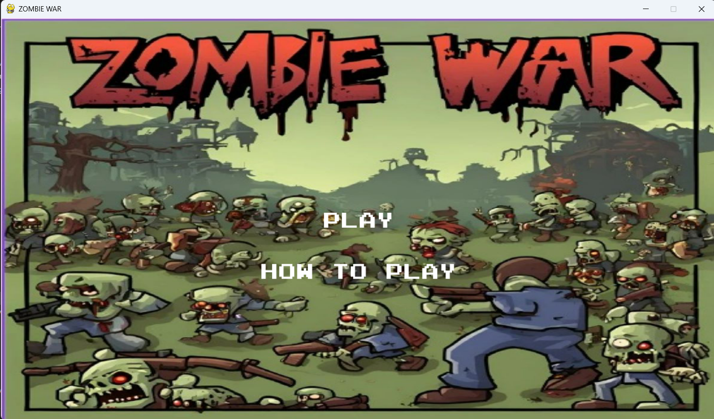
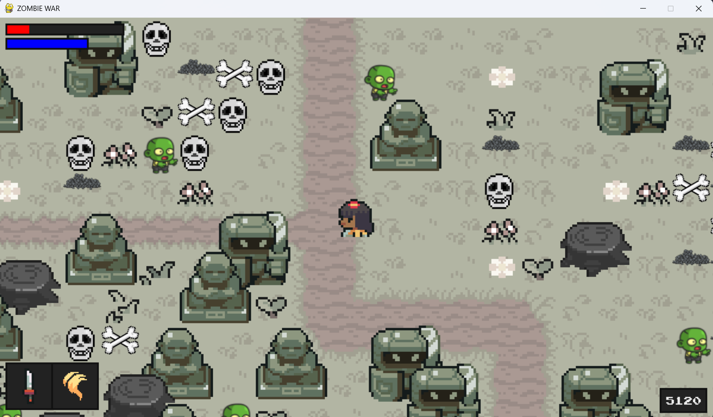
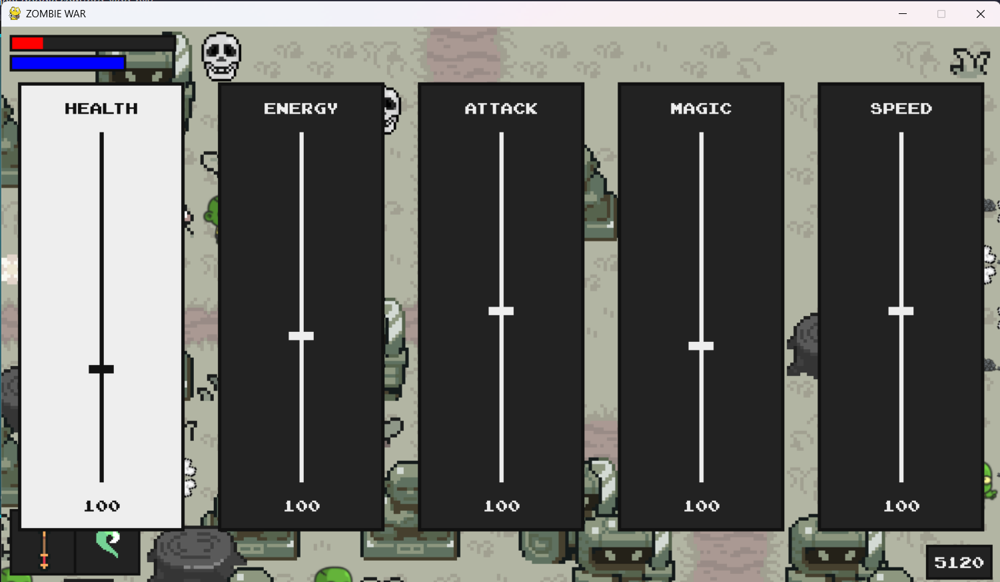
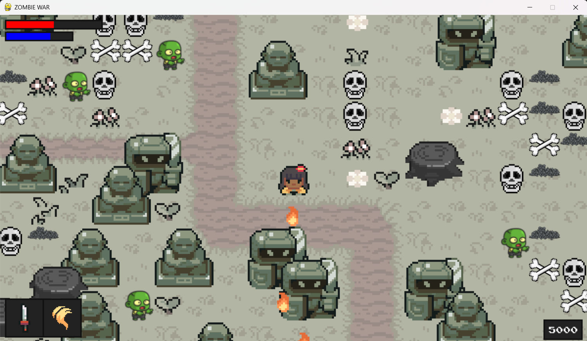
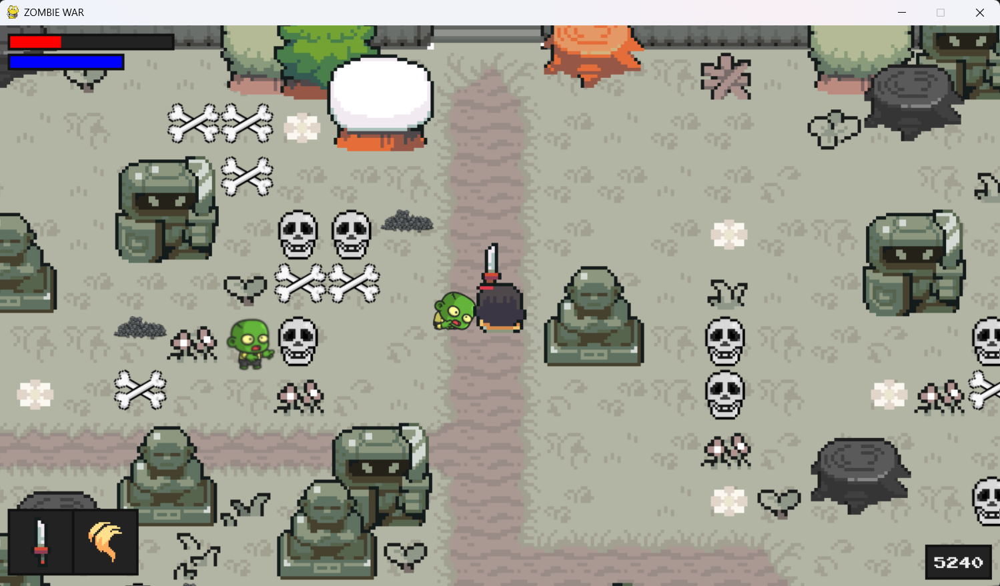
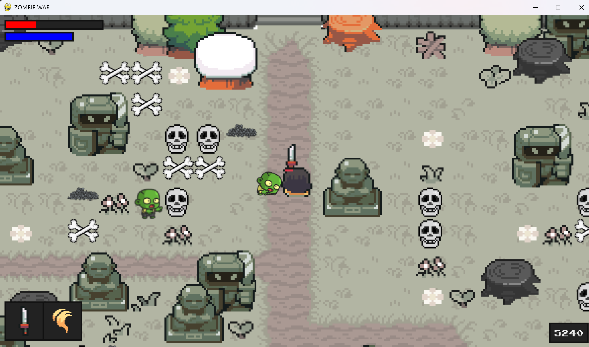

# Zombie War

**Zombie War** is an exciting 2D survival game where players must fend off waves of zombies in an apocalyptic setting. The game features unique maps designed using the Tiled map editor and immersive gameplay mechanics powered by Pygame. 

## Table of Contents

- [Game Overview](#game-overview)
- [Features](#features)
- [Technologies Used](#technologies-used)
- [Installation](#installation)
- [Gameplay](#gameplay)
- [Controls](#controls)
- [Contributing](#contributing)

## Game Overview

In **Zombie War**, you play as a lone survivor battling against hordes of zombies in various settings. The objective is to survive as long as possible while collecting resources, upgrading weapons, and exploring the map for strategic advantages. The game features multiple levels, progressively difficult enemies, and power-ups to enhance the player's abilities.

The game map is designed using the **Tiled** map editor, offering dynamic environments and challenges to keep players engaged. 

## Features

- **Procedural Map Design**: Levels are designed using the Tiled map editor, offering intricate layouts with obstacles, resources, and hidden areas.
- **Zombie Waves**: Endless waves of zombies with increasing difficulty.
- **Weapons and Upgrades**: Players can collect and upgrade weapons to fight off stronger zombies.
- **Power-ups**: Time-limited abilities such as increased speed, damage boosts, and invincibility.
- **Health and Survival Mechanics**: Players must maintain health by collecting health kits scattered across the map.
- **Multiple Enemy Types**: From slow-moving zombies to fast, aggressive ones with unique abilities.
- **Score and Leaderboard**: Track your survival time and compare scores with friends.
- **Sound Effects and Music**: Atmospheric sound effects and background music to enhance the immersive gameplay experience.
- **Customizable Maps**: Future potential to add custom maps via the Tiled map editor for an extended gameplay experience.

## Technologies Used

- **Pygame**: Python library for building 2D games.
- **Tiled Map Editor**: Tool used to design 2D game maps, allowing for customization and level creation.
- **Python**: The core programming language used for game logic.
- **Sprites and Assets**: 2D pixel art for characters, enemies, and items.

## Screenshots







## Installation

1. **Clone the repository**:

   ```bash
   git clone https://github.com/yourusername/zombie-war.git
   ```

2. **Navigate to the project directory**:

   ```bash
   cd zombie-war
   ```

3. **Install the required dependencies**:

   Ensure you have Python installed, then install Pygame:

   ```bash
   pip install pygame
   ```

4. **Run the game**:

   ```bash
   python main.py
   ```

## Gameplay

- **Survive**: The goal is to survive endless waves of zombies for as long as possible.
- **Collect Weapons**: Find weapons scattered across the map to defend yourself against zombies.
- **Upgrade Your Gear**: As you progress, collect upgrades to make your weapons more powerful.
- **Power-ups**: Use power-ups to gain temporary advantages like increased speed or invincibility.
- **Explore the Map**: Discover hidden areas, resources, and strategic positions in each level.

## Controls

- **Arrow Keys / WASD**: Move the character.
- **Spacebar**: Shoot or use the equipped weapon.
- **E**: Interact with objects (e.g., pick up weapons or power-ups).
- **P**: Pause the game.
- **Esc**: Quit the game.

## Contributing

Contributions are welcome! To contribute:

1. Fork the repo and clone it locally.
2. Create a new branch: `git checkout -b feature-name`
3. Make your changes and commit them.
4. Push the branch: `git push origin feature-name`
5. Open a pull request explaining your changes.
